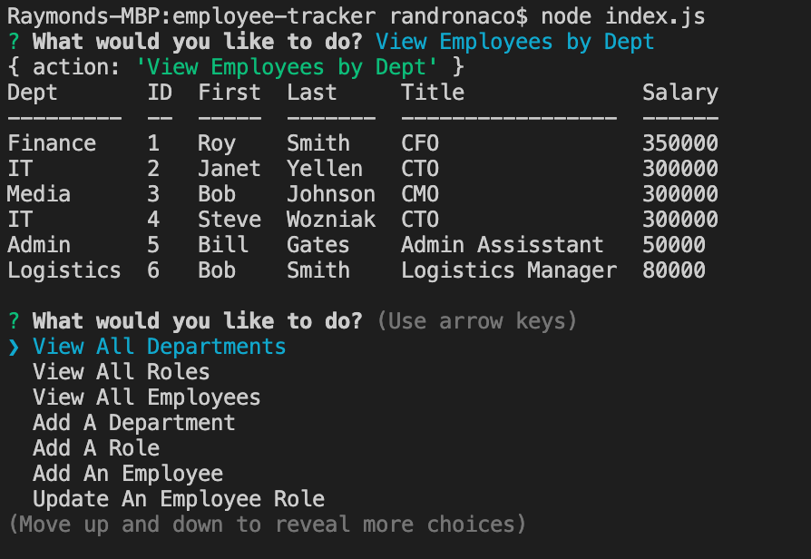

# employee-tracker

## User Story
AS A business owner

I WANT to be able to view and manage the departments, roles, and employees in my company

SO THAT I can organize and plan my business

## Usage
A user is prompted with options to view a list of departments, roles or employees as well as sorted lists of employees by manager or department.

The user is given the option to add an employee, role or department to the SQL database.

Once the inquirer prompts are filled out then this information is pushed to the databases.

All actions are performed from the command line.

## Walkthrough Video
https://drive.google.com/file/d/12BKY78hpshv28wRp4deUgzAwFhGjVrWe/view?usp=sharing 

## Preview of application

## Packages Used
mySQL2 Package

inquirer

console.table

## GitHub Repository
https://github.com/randronaco1027/employee-tracker